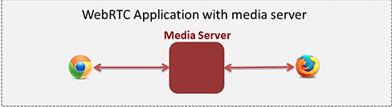
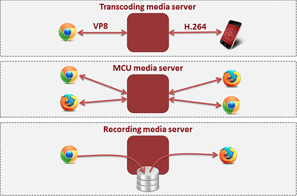
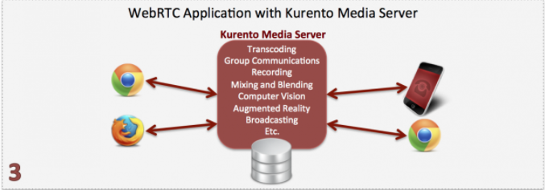
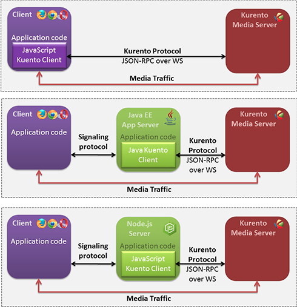

# Kurento
Kurento es un servidor multimedia WebRTC y un grupo de APIs del lado del cliente que facilita el desarrollo de aplicaciones de video avanzadas en aplicaciones Web y en otros dispositivos.   

## Servidores multimedia WebRTC
 
WebRTC es proyecto open source que permite a los navegadores tener una comunicación en tiempo real de manera P2P (Peer to Peer). Por ser así es dificl hacer, por ejemplo, comunicaciones en grupo, por lo cual ciertas aplicaciones requieren de un servidor multimedia.  
El servidor mulitmedia funciona como un middleware entre los dos navegadores, recibiendo el tráfico multimedia y procesandolo antes de enviarlo al otro extremo. 



El procesamiento puede incluir, por ejemplo, enviar a un grupo de receptores (en vez de solo a uno), transcodificar (adaptar formatos para clientes que no son compatibles), grabar, mezclar, etcétera. 




## Arquitectura de Kurento 
Kurento está construido sobre dos capas o planos: 

- Signaling Plane (Plano de señalización): Encargado de manejar las comunicaciones con los clientes (lado derecho de la imagen). Este plano se encuentra del lado de la aplicación. 
- Media Plane (Plano de multimeida): Encargado de llevar a cabo las funcionalidades de de Kurento (lado izquierdo de la imagen). Este plano se encuentra en el Kurento Media Server.


### Kurento Media Server (KMS)
Este es el núcelo de Kurento y la base de todo su funcionamineto. Esta basado en diferentes módulos que realizan procesamientos y que se pueden agregar o quitar a tu aplicación de manera dinámica. 
De igual manera, como programador puedes crear tus propios modulos y utilizarlos con kurento. 
KMS cuenta con módulos para, por ejemplo, comunicación en grupo, mezclas, transcodificación, grabaciones, reproducciones, procesamiento para visión por computadora, realidad aumentada, entre otros. 




### Kurento API

Kurento se muestra hacia el exterior por medio de una API. Para podernos comunicar con la API existen tres formas:

- Usar directamente el protocolo de comunicación de Kurento.
- A través de un cliente de Java. 
- Utilizando el cliente de JavaScript en NodeJS. 




El protocolo de comunicación de Kurento (*Kurento Protocol*) es un protocolo de red que esta basado en "WebSocket" (esta especificación define un socket full duplex de comunicación entre cliente y servidor) y en "JSON-RPC". 

Kurento está compuesto por dos grandes bloques que se utilizan para el desarrollo de aplicaciones: 

- **Media Elements**: Cada uno de ellos son una unidad funcional que llevan a cabo una acción específica sobre multimedia. Se pueden ver como cajas negras a las cuales les entregas multimedia y realizan sobre ellas una acción. Según su funcionamiento se pueden dividir como: 
	- *Input Endpoints*: Son aquellos que son capaces de recibir multimedia y enviarlas a través de un canal de comunicación hacia otro componente. Pueden obtener los datos multimedia a través de un archivo (File Input), a través de una red (Network Input) o directamente de hardware (Capture Input).
	- *Filters*: Son aquellos capaces de transformar y analizar datos multimedia. Pueden, por ejemplo, mezclar, aumentar, analizar, etcétera. 
	- *Hubs*: Son aquellos capaces de manejar muchos flujos de datos multimedia a través de un solo canal de comunicación.
	- *Output Endpoints*: Son aquelos capaces de extraer datos multimedia del canal de comunicación. 

-**Media Pipeline**: Es una cadena de elementos multimedia en donde el flujo de datos generado por una fuente se alimenta a uno o muchos otros elementos. Esta formada por "Media Elements" conectados entre sí.  

Así, tenemos aquí algunos "Media Elements":


Si juntamos dos o más tendremos un "Media Pipeline":


Para información específica sobre diferentes "Media Elements" se puede visitar [aquí](http://doc-kurento.readthedocs.io/en/latest/mastering/kurento_API.html).


## Usando Kurento 
Ahora haremos un 


Para los tutoriales necesitamos un montón de herramientas. Por eso es tan largo el proceso que se pone al final de este tutorial.  Algunas de las herramientas son:

- Java, 
- JavaScript, 
- NodeJS, 
- git, 
- npm, 
- bower, 
- IDE de desarrollo, etc.  

Entramos a la cuenta de lab.fiware.org, creamos una instancia a partir de una imagen y lo ejecutamos(`images/launch/...`)

En este tutorial levantaremos una imagen en nuestro ambiente local.

No está en github, así que haremos todo a mano.  

```bash
# Install Vagrant Ubuntu 14.04 LTS ----------------------------------------------------------------
vagrant init ubuntu/trusty64

#### -->  Hay que descomentar la línea 34 config.vm.network 

# Habilitar config.vm.network para crear una red privada

vagrant up

vagrant ssh
private_key:""
password: vagrant

pwd
lsb_release -a  ; para ver la versión de ubuntu

ip addr show  ; Me dio 192.168.85.149 en eth1

# Install Kurento ---------------------------------------------------------------------------------

echo "deb http://ubuntu.kurento.org trusty kms6" | sudo tee /etc/apt/sources.list.d/kurento.list
wget -O - http://ubuntu.kurento.org/kurento.gpg.key | sudo apt-key add -
sudo apt-get update
sudo apt-get install kurento-media-server-6.0

# Running KMS
sudo service kurento-media-server-6.0 start
sudo service kurento-media-server-6.0 stop


# Verified running server
curl -i -N -H "Connection: Upgrade" -H "Upgrade: websocket" -H "Host: 192.168.33.10:8888" -H "Origin: 127.0.0.1" http://192.168.33.10:8888/kurento


# Verifica servicio
ps -ef | grep kurento-media-server

# Verifica puerto
sudo netstat -putan | grep kurento

# Ver Logs
cd /var/log/kurento-media-server/


# Install Kurento Client ---------------------------------------------------------------------------

# Install Git ***************************************
sudo apt-get update
sudo apt-get install git

# Install Maven *************************************
sudo apt-cache search maven
sudo apt-get install maven

# Config JAVA_HOME
export JAVA_HOME=/usr/lib/jvm/java-7-openjdk-amd64
export PATH=$JAVA_HOME/bin:$PATH

sudo apt-get install openjdk-7-jdk openjdk-7-doc openjdk-7-jre-lib

# Install node.js y Bower *********************************
curl -sL https://deb.nodesource.com/setup | sudo bash -
sudo apt-get install -y nodejs
sudo npm install -g bower

# ********************** Cliente [Java - Hello world] **********************
# http://doc-kurento.readthedocs.io/en/stable/tutorials/java/tutorial-helloworld.html
git clone https://github.com/Kurento/kurento-tutorial-java.git

# ************  También clonaremos los de java script y los de nodejs ****************
git clone https://github.com/Kurento/kurento-tutorial-js.git
git clone https://github.com/Kurento/kurento-tutorial-node.git

cd kurento-tutorial-java/kurento-hello-world
git checkout 6.6.0

# Si estamos de manera local es el primero;  el de abajo si estamos de manera independiente
# mvn simplifica el manejo de jars: Solo se declaran librerías y se descargan solo las que se necesitan y seguro son consistentes con las versiones


#mvn compile exec:java  La IP es de donde se encuentra el KMS
# En el ejemplo Hello world, solamente estamos haciendo un echo back en el pipeline

mvn compile exec:java -Dkms.url=ws://192.168.81.5:8888/kurento

# Se invoca esto desde un servidor en la computadora.  Mi direccion es 85.149
https://192.168.81.5:8443/


# Local
https://127.0.0.1:8443/

# ******************** Cliente [JavaScript - Hello world] ********************
# http://doc-kurento.readthedocs.io/en/stable/tutorials/js/tutorial-helloworld.html
curl -sL https://deb.nodesource.com/setup | sudo bash -
sudo apt-get install -y nodejs
sudo npm install -g bower

# Aquí necesitaremos un servidor 
sudo npm install http-server -g

git clone https://github.com/Kurento/kurento-tutorial-js.git
cd kurento-tutorial-js/kurento-hello-world
git checkout 6.6.0

# Esto es para descargar todas las dependencias
bower install

# ... y ejecutamos el servidor. 
http-server -p 8443 -S -C keys/server.crt -K keys/server.key

https://192.168.33.10:8443
# Lo que se ve aquí es la misma página pero los mensajes que se reciben en el log son distintos y no se ve en el servidor

# El comando anterior, sí entra el cliente pero no hay retorno desde el servidor.
# Por eso se propuso la siguiente instrucción, donde creamos web socket... desgraciadamente no sirve
# En chrome hay una cruz a la derecha arriba, se le da clic permitiendo ejecución de secuencias no seguras y si funciona

https://192.168.81.5:8443/index.html?ws_uri=ws://192.168.81.5:8888/kurento


# Local
https://127.0.0.1:8443/index.html?ws_uri=ws://192.168.81.5:8888/kurento

# ******************** Cliente [Node.js - Hello world] ********************
# http://doc-kurento.readthedocs.io/en/stable/tutorials/node/tutorial-helloworld.html
curl -sL https://deb.nodesource.com/setup | sudo bash -
sudo apt-get install -y nodejs
sudo npm install -g bower

git clone https://github.com/Kurento/kurento-tutorial-node.git
cd kurento-tutorial-node/kurento-hello-world
git checkout 6.6.0
npm install
npm start

https://192.168.81.5:8443/

#  Aquí vamos a la versión magic mirror solo para que se agregue una figura:  detecta caras y mete un gorrito

# ******************** Cliente [WebRTC one-to-one video call (java)] ********************
# http://doc-kurento.readthedocs.io/en/stable/tutorials.html#webrtc-one-to-one-video-call
git clone https://github.com/Kurento/kurento-tutorial-java.git
cd kurento-tutorial-java/kurento-one2one-call
git checkout 6.6.0
#mvn compile exec:java
mvn compile exec:java -Dkms.url=ws://192.168.81.5:8888/kurento

https://192.168.81.5:8443/

# ******************** Cliente [WebRTC one-to-one video call with recording and filtering] ********************
# http://doc-kurento.readthedocs.io/en/stable/tutorials/java/tutorial-one2one-adv.html

# Este es interesante porque intercepta los flujos en los dos sentidos

git clone https://github.com/Kurento/kurento-tutorial-java.git
cd kurento-tutorial-java/kurento-one2one-call-advanced
git checkout 6.6.0
#mvn compile exec:java
mvn compile exec:java -Dkms.url=ws://192.168.81.5:8888/kurento

https://192.168.81.5:8443/


# ******************** Cliente [Java - WebRTC magic mirror] ********************
# http://doc-kurento.readthedocs.io/en/stable/tutorials/java/tutorial-magicmirror.html
git clone https://github.com/Kurento/kurento-tutorial-java.git
cd kurento-tutorial-java/kurento-magic-mirror
git checkout 6.6.0
#mvn compile exec:java
mvn compile exec:java -Dkms.url=ws://192.168.81.5:8888/kurento

https://192.168.81.5:8443/

# ******************** Cliente [Java - Metadata] ********************
# http://doc-kurento.readthedocs.io/en/stable/tutorials/java/tutorial-metadata.html
git clone https://github.com/Kurento/kurento-tutorial-java.git
cd kurento-tutorial-java/kurento-metadata-example
git checkout 6.6.0
#mvn compile exec:java
mvn compile exec:java -Dkms.url=ws://192.168.81.5:8888/kurento

# *******************************************************************************

# Install STUN Server -------------
# https://code.google.com/archive/p/coturn/

sudo iptables -A INPUT -p udp --dport 8433 -j ACCEPT
sudo iptables -A INPUT -p udp --dport 8433 -j ACCEPT
sudo iptables -A OUTPUT -p udp --dport 8433 -j ACCEPT
sudo iptables -A OUTPUT -p udp --dport 8433 -j ACCEPT
sudo iptables -A INPUT -p tcp --dport 8433  -j ACCEPT

# Creacion de Red Virtual en Windows
netsh wlan set hostednetwork mode=allow ssid="kurento_ssid" key="12345678"
netsh wlan start hostednetwork

https://192.168.81.5:8443/index.html?ws_uri=wss://192.168.81.5:8888/kurento
https://192.168.81.5:8443/index.html?ws_uri=ws://192.168.81.5:8888/kurento

--------------------------------------------------------------------

# http://www.kurento.org/

# Instalacion de Docker
sudo apt-get update

sudo apt-get install -y --no-install-recommends \
    linux-image-extra-$(uname -r) \
    linux-image-extra-virtual
    
sudo apt-get install -y --no-install-recommends \
    apt-transport-https \
    ca-certificates \
    curl \
    software-properties-common
    
curl -fsSL https://apt.dockerproject.org/gpg | sudo apt-key add -

sudo add-apt-repository \
       "deb https://apt.dockerproject.org/repo/ \
       ubuntu-$(lsb_release -cs) \
       main"

# Install Docker

sudo apt-get update

sudo apt-get -y install docker-engine

sudo docker run hello-world

# Install Docker Kurento
sudo docker run --name kms -p 8888:8888 -d kurento/kurento-media-server

curl -i -N -H "Connection: Upgrade" -H "Upgrade: websocket" -H "Host: 127.0.0.1:8888" -H "Origin: 127.0.0.1" http://127.0.0.1:8888/kurento

sudo docker logs kms


iptables -A INPUT -p udp -m udp --dport 8888 -j ACCEPT
iptables -A OUT -p udp -m udp --dport 8888 -j ACCEPT
```


