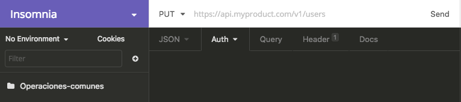

# Gestión de información de contexto con Orion Context Broker

Nuestro objetvo final es hacer aplicaciones inteligentes que utilicen información obtenida de diferentes medios como sensores, usuarios de dispositivos móviles, etéctera. 


Para que nuestra aplicación pueda obtener esa información utilizaremos Orion Context Broker (OCB). Orion Context Broker es una implementación de la API NGSI (*Next Generation Service Interface Context Enabler*) que te permite manejar y asegurar la disponibilidad de la información obtenido del contexto. 

Para representar objetos de la vida real utilizaremos el modelo de entidades de la API NGSI. En éste se define un **modelo de datos** de información de contexto basado en *entidades* y en *atributos*. Cada entidad representa un objeto de la vida real y puede tener atributos y metadatos. Las entidades cuentan con ID y tipo y los atributos y metadatos con nombre, tipo y valor. Todos los datos estarán representados con el formato JSON.  
Los metadatos son infromación de los atributos y se ponen con la misma estructura. 

Por ejemplo, modelaremos la temperatura y la presión de un cuarto con la siguiente entidad:

	{
		"id": "Cuarto1"
		"type": "Cuarto"
		"temperature": {
			"type": "Float",
			"value": 23,
			"metadata":{
				“precision”: {
    				“type”:xxx,
  					“value”: xxx
				}
			}
		},
		"pressure":{
			"type":"Integer",
			"value": 720
		}
	}
	

La interacción básica con el OCB consta de tres agentes: el productor de información de contexto, el context broker (CB) y el consumidor de esa información.


El productor de información de contexto se encargará de crear nuevas entidades o de actualizar las entidades ya existentes a través del puerto 1026.    
Los datos se mantendrán persistentes gracias al CB, que además funciona como intermediario entre los otros dos agentes. Éste solamente guardará el último dato que se ingresó por lo que para poderlos almacenar usremos MongoDB.  
El consumidor será el que obtenga la información del CB para su uso final también a través del puerto 1026. La obtención de la información se puede dar a través de consultas a la base de datos (querys)y por medio de notificaciones. 

Una característica muy importante es que para el OCB no importa de donde se está obteniendo la información, al final, la aplicación la recibirá igual. Así, toda la información que ulizaremos estará homogeneizada y podremos usarla facilmente.   

### Configuración de la máquina virtual
Se requiere tener instalado en la computadora:
	
* VirtualBox
* SSH
* Vagrant 1.9.0
* Git
* Insomnia


Vagrant es un versionador de máquinas virtuales con lo cual es muy fácil comenzar a hacer uso de ellas. 
Con esta herramienta crearemos una máquina virtual con el sistema operativo CentOs dentro del cual se instalará también docker, MongoDB y OCB. 
Para poder instalar la máquina virtual en nuestra computadora haremos los siguientes pasos:

```
# Utilizando la terminal. 
	#### Set up
	# crear carpeta
	mkdir cursoFiware
	# cambiar de directorio
	cd cursoFiware
	# bajar estructura de las máquinas virtuales
	git clone https://github.com/capcaz99/FIWARE.git
	# Cambiar a directorio Fiware
	cd FIWARE
	cd vm-fiware-orion
	# iniciar máquina virtual de Orion, este proceso puede tardar
	vagrant up
	# conectar a máquina virutal por medio de SSH
	vagrant ssh
	#iniciar docker de OCB
	docker-compose up
```
Después de haber realizado estos pasos tendremos al OCB corriendo en nuestra computadora.

### Interactuando con OCB
La interacción con el OCB la haremos a través de solicitudes HTTP con un cliente REST.
Para poder hacerlo nececitamos especificar el URL al cual estaremos haciendo la solicitud, el método REST de la solicutud, el encabezado y el cuerpo de la solicitud.   
El URL al que haremos la solicitud sera: **http://localhost:1026/v2/...**. Aquí podemos ver, como se indicaba en el diagrama, que la comunicacion se hace a través del puerto 1026 y que la versión del OCB es la 2.  
Los métodos REST que utilizaremos son **GET, POST, PUT, DELETE, OPTIONS, HEAD, TRACE, CONNECT.**  
El encabezado indica en que formato se estará recibiendo y enviando la información. Si la información será de tipo JSON se debe poner **application/json** y si será de tipo texto se debe de poner **text/plain**.
Para referirse a que estarás enviando información se debe de poner **Content-Type** y para indicar que quieres recibir se debe de poner **Accept**.  

Así, una solicitud quedaría de la siguiente manera: 
 

```
xx.xx.xx:pto/v2/entities
Método: POST
Headers: Content-Type:application/json
Body:
{  “id”: xx
   “type”: xx
   “atributo”:{
   		"value":xx
   }
   ...
}
```


  
Para poder interactuar con OCB utilizaremos *insomnia*.  
Crearemos en insomnia una carpeta llamada **Operaciones-Comunes**. En esta carpeta se guardarán todas las consultas que hagamos. 



#### POST
En primer lugar hay que **crear** la entidad con el método **POST**:
Comenzaremos por crear una nueva petición en Insomnia


El nombre sugerido para esta petición es **inserta-entidad**, el método que utilizaremos será **PUT** y el body será de tipo JSON.

  

Como habíamos mencionado antes nuestras peticiones se conforman por tres partes.  
En este caso el URL que utilizaremos será **http://localhost:1026/v2/entities**, el header se pone automaticamente cuando seleccionamos JSON como el tipo de dato (si queremos que el body sea text/plain lo debemos de especificar en la pestaña de Header de insomnia) y en el body pondremos:

```
{
		"id": "lugar01",
		"type": "ParkingSpot",
		"floor" :{
			"value":"PB",
			"type":"text"
	    },
		"name" :{
			"value":"A-13"
	    },
		"status" :{
			"value":"libre"
	    }
	}
```
	
#### GET
Para **obtener** todas las entidades que tenemos guardadas usaremos el método **GET**:

```
localhost:1026/v2/entities
Método: GET
```
En este caso no se especifican ni el body ni Content-type.  
No obstante si se está consultando un OCB en la nube, será necesario agregar en el campo X-Auth-Token el token que les fue asignado.

```
Headers X-Auth-Token	1O11Qj4FReeHTs0Rb5hVLYwKNHFbbu
```
Podemos también buscar una entidad en específico por medio de su ID, para lo cual tenemos que poner **/{id}** al final de nuestro URL.

```
Método: GET
{url}:1026/v2/entities/{id}
```
Así:

```
localhost:1026/v2/entities/lugar01
Método: GET
```

#### PUT y PATCH  
Podemos también **actualizar** una entidad.   
Una nueva convención a surgido para diferenciar los dos métodos existentes para actualizar. Si queremos actualizar una parte de la entidad se debe utilizar el método **PATCH** y si se quiere actalizar la entidad completa se debe de utilizar el método **PUT**, teniendo en cuenta que si no se especifican algunos atributos éstos deberían colocarse en nulo. En realidad muchas de las aplicaciones no toman en cuenta esta distinción y utilizan el método PUT como un sinónimo del método PATCH pero es importante conocer la diferencia.

```
Método: PUT
{url}:1026/v2/entities/{id}
```
```
Método: PATCH
{url}:1026/v2/entities/{id}/attrs/{value}/value
```
Así tenemos:

```
localhost:1026/v2/entities/lugar01
Método: PUT
Headers: Content-Type:application/json
Body;
{
		"id": "lugar01",
		"type": "ParkingSpot",
		"floor" :{
			"value":"PB",
			"type":"text"
	    },
		"name" :{
			"value":"A-13"
	    },
		"status" :{
			"value":"ocupado"
	    }
	}
```

```
localhost:1026/v2/entities/lugar01/attrs/status/value
Método: PATCH
Headers: Content-Type:text/plain
Body:
	"ocupado"
```
En ambos casos cambiando el valor de status por ocuapado. 

#### Delete
Este comando eliminará atributos y entidades. 
Para borrar una entidad se utiliza a siguiente expresión: 

```
{url}:1026/v2/entities/{id}
Método: DELETE
```

Y para borrar un atributo:

```
{url}:1026/v2/entities/{id}/attrs/{value}
Método: DELETE
```
## OCB Query Language  
También podemos hacer consultas con filtros para encontrar infromación más específica. 
Para comenzar poblaremos la base de datos con una petición POST y los siguientes datos:
El url que debemos utilizar es 
```
http://localhost:1026/v2/op/update
``` 
ya que vamos a introducir varias entidades a la vez. Podríamos tambien hacer una petición POST por cada una de las entidades pero es más fácil así. 

```
{
	"actionType":"APPEND",
	"entities":[
	{
		"id": "CampusA01",
		"type": "ParkingSpot",
		"name" :{
			"value":"A-01"
		},
		"floor" :{
			"value":"PB"
		},
		"status" :{
			"value":"libre"
		}
	},
	{
		"id": "CampusA02",
		"type": "ParkingSpot",
		"name" :{
			"value":"A-02"
		},
		"floor" :{
			"value":"PB"
		},
		"status" :{
			"value":"libre"
		}
	},
	{
		"id": "CampusA13",
		"type": "ParkingSpot",
		"name" :{
			"value":"A-11"
		},
		"floor" :{
			"value":"PA"
		},
		"status" :{
			"value":"libre"
		}
	},
	{
		"id": "CampusB01",
		"type": "ParkingSpot",
		"name" :{
			"value":"A-01"
		},
		"floor" :{
			"value":"PB"
		},
		"status" :{
			"value":"ocupado"
		}
	},
	{
		"id": "CampusB02",
		"type": "ParkingSpot",
		"name" :{
			"value":"A-02"
		},
		"floor" :{
			"value":"PB"
		},
		"status" :{
			"value":"ocupado"
		}
	},
	{
		"id": "CampusB13",
		"type": "ParkingSpot",
		"name" :{
			"value":"B-13"
		},
		"floor" :{
			"value":"PA"
		},
		"status" :{
			"value":"desconocido"
		}
	},
	{
		"id": "CampusC01",
		"type": "ParkingSpot",
		"name" :{
			"value":"A-01"
		},
		"floor" :{
			"value":"PB"
		},
		"status" :{
			"value":"ocupado"
		}
	},
	{
		"id": "CampusC02",
		"type": "ParkingSpot",
		"name" :{
			"value":"A-02"
		},
		"floor" :{
			"value":"PB"
		},
		"status" :{
			"value":"ocupado"
		}
	},
	{
		"id": "CampusC13",
		"type": "ParkingSpot",
		"name" :{
			"value":"B-11"
		},
		"floor" :{
			"value":"PA"
		},
		"status" :{
			"value":"desconocido"
		}
	}
	]
}
```

Crearemos una petición con el método GET y el URL que ya conocemos. En insomnia hay una pestaña llamada "Query", en esta pestaña podemos poner el nombre y el valor de lo que estamos buscando y automaticamente lo agrega a nuestro URL. Si, por ejemplo, quisieramos buscar una entidad con id ```CampusB13```se vería así: 
 


A partir de ahora todos los datos que se proporcionen para hacer la consulta se deben poner en esa pestaña de Insomnia. 

Cuando relizamos consultas el OCB devuelve 20 elementos por defecto.
Podemos hacer una consulta que nos devuelva más o menos elementos utilizando el parámetro ```limit ``` en el query.

```
limit = 2
```


Al hacer las consultas, el OCB lo devuelve en el orden en el que está en la BD, por lo que, si queremos cambiar el lugar donde inicie a leer los datos podemos utilizar el parámetro ```offset```en el query.

```
offset = 3
```

Por otro lado, si no queremos recibir la infromación en formato NGSI podemos utilizar el parámetro ```options```en el query. 

```
options = keyValues
```


Con el parámetro ```attrs```podemos obtener las propiedades que específiquemos unicamente. También, con el parámetro ```q```podemos específicar una condición para filtrar nuestra búsqueda. Así, si queremos obtener todos los lugares vacíos pero solamente su nombre, piso y estado, todo sin formato NGSI tenemos:

```
q       = status==libre
attrs   = name,floor,status
options = keyValues 
```


## Datos geo-referenciados
Las entidades pueden tener como atributo su ubicación (location) para resolver diferentes problemas.

* Lugares de interés.
* Servicios cercanos.
* Notificaciones.

Para poder trabajar con esto poblaremos la base de datos con lugares de interés en la Ciudad de México:

```
{
  "actionType": "APPEND",
	"entities": [
		{
			"id": "Catedral",
			"type": "PointOfInterest",
			"category": {
				"type": "Text",
				"value": "iglesia",
				"metadata": {}
			},
			"location": {
				"type": "geo:point",
				"value": "19.435433, -99.133072",
				"metadata": {}
			},
			"name": {
				"type": "Text",
				"value": "Catedral Metropolitana",
				"metadata": {}
			},
			"postalAddress": {
				"type": "StructuredValue",
				"value": {
					"addressCountry": "MX",
					"addressLocality": "México Ciudad de México",
					"addressRegion": "Ciudad de México"
				}
			}
		 },
       {
			"id": "Zocalo",
			"type": "PointOfInterest",
			"category": {
				"type": "Text",
				"value": "Plaza",
				"metadata": {}
			},
			"location": {
				"type": "geo:point",
				"value": "19.432579, -99.133287",
				"metadata": {}
			},
			"name": {
				"type": "Text",
				"value": "Zocalo",
				"metadata": {}
			},
			"postalAddress": {
				"type": "StructuredValue",
				"value": {
					"addressCountry": "MX",
					"addressLocality": "México Ciudad de México",
					"addressRegion": "Ciudad de México"
				}
			}
		},
       {
			"id": "PalacioNacional",
			"type": "PointOfInterest",
			"category": {
				"type": "Text",
				"value": "Edificio",
				"metadata": {}
			},
			"location": {
				"type": "geo:point",
				"value": "19.432336, -99.131452",
				"metadata": {}
			},
			"name": {
				"type": "Text",
				"value": "Palacio Nacional",
				"metadata": {}
			},
			"postalAddress": {
				"type": "StructuredValue",
				"value": {
					"addressCountry": "MX",
					"addressLocality": "México Ciudad de México",
					"addressRegion": "Ciudad de México"
				}
			}
		},
       {
			"id": "BellasArtes",
			"type": "PointOfInterest",
			"category": {
				"type": "Text",
				"value": "Edificio",
				"metadata": {}
			},
			"location": {
				"type": "geo:point",
				"value": "19.435180, -99.141207",
				"metadata": {}
			},
			"name": {
				"type": "Text",
				"value": "Palacio de Bellas Artes",
				"metadata": {}
			},
			"postalAddress": {
				"type": "StructuredValue",
				"value": {
					"addressCountry": "MX",
					"addressLocality": "México Ciudad de México",
					"addressRegion": "Ciudad de México"
				}
			}
		},
       {
			"id": "TorreLatino",
			"type": "PointOfInterest",
			"category": {
				"type": "Text",
				"value": "Edificio",
				"metadata": {}
			},
			"location": {
				"type": "geo:point",
				"value": "19.433874, -99.140685",
				"metadata": {}
			},
			"name": {
				"type": "Text",
				"value": "Torre Latino",
				"metadata": {}
			},
			"postalAddress": {
				"type": "StructuredValue",
				"value": {
					"addressCountry": "MX",
					"addressLocality": "México Ciudad de México",
					"addressRegion": "Ciudad de México"
				}
			}
		}
  ]
}
```

Como podemos ver en los datos el atributo *"location"* es de tipo *geo:point* en donde se tiene como valores la longitud y la latitud del lugar de interés.  
Ahora buscaremos lugares de interés que se encuentren dentro o fuera de una una figura geométrica. Para poderlo hacer usaremos la versión uno de la API NGSI, en vez de la versión dos que hemos estado utilizando, ya que ésta usa queries de contexto.  
Comenzaremos con los lugares de interés fuera de una circunferencia.   Para especificar el círculo con el que estaremos trabajando haremos una petición POST con los siguientes datos:

```
URL: localhost:1026/v1/queryContext
BODY:
{
    "entities": [
        {
            "type": "PointOfInterest",
            "isPattern": "true",
            "id": ".*"
        }
    ],
	"attributes":[
		"location","name"
	],
    "restriction": {
        "scopes": [
            {
                "type": "FIWARE::Location",
                "value": {
                    "circle": {
                        "centerLatitude": "19.432594",
                        "centerLongitude": "-99.133017",
                        "radius": "50",
						    "inverted":"true"
                    }
                }
            }
        ]
    }
}
```

En los datos podemos ver claramente que estamos creando un circulo, indicando el lugar en donde está ubicado su centro y el radio que tendrá (expresado en metros). Al poner ```inverted=true``` estamos indicando que queremos los elementos que estén fuera del círculo.  
Cuando hacemos la consulta la respuesta del método serán los lugares que están fuera del circulo indicado. 

Ahora haremos una consulta buscando todos los puntos de interés que se encuentren dentro de un polígono. Usaremos el mismo URL utilizado en la consulta anterior y cambiaremos el body por la siguiente informacíon:

```
{
	"entities": [
		{
			"type": "PointOfInterest",
			"isPattern": "true",
            "id": ".*"
		}
	],
	"attributes": [
		"location"
	],
	"restriction": {
		"scopes": [
			{
				"type": "FIWARE::Location",
				"value": {
					"polygon": {
						"vertices": [
							{
								"latitude": "19.432218",
								"longitude": "-99.133836"
							},
							{
								"latitude": "19.431994",
								"longitude": "-99.132480"
							},
							{
								"latitude": "19.433089",
								"longitude": "-99.132380"
							},
							{
								"latitude": "19.433254",
								"longitude": "-99.133841"
							}
						],
						"inverted": "false"
					}
				}
			}
		]
	}
}
```

Como podemos ver ahora el atributo ```inverted```se encuentra en false. Por otro lado, el polígono se forma por cinco vértices los cuales están claramente indicados en la consulta.


## Suscrpitores
Hasta el momento hemos hablado de la manera en la que se crean los productores de información de contexto y como es que estos interactuan con el OCB y como se puede obtener información de manera síncrona haciendo solicitudes REST al OCB. Ahora hablaremos de como se puede obtener información del OCB de maner asíncrona por medio de suscripciones.  

Para poder recibir información por notificaciones, el consumidor debe suscribirse a un evento. De esta manera lograremos que, sin importar donde se encuentra la aplicación y el productor de información de contexto, el consumidor pueda tener la información que nececita siempre que haya un cambio.  

Insertaremos una nueva entidad de tipo Cuarto para crear un suscriptor que reciba notificaciones cuando la temperatura del cuarto cambie.  
Para esto primero debemos insertar la siguiente entidad: 

```
{
	"id":"Cuarto01",
	"type":"Room",
	"temperature": {
		"value":"23"
	},
	"pressure":{
		"value": 43
	}
}
``` 
Hay que recordar que esto se hace por medio del método POST.   
Ahora crearemos al suscriptor. Para poder hacerlo debemos hacer una solicitud de tipo POST al url ``http://localhost:1026/v2/subscriptions`` con la siguiente información: 

```
{
	"description": "Update average rating",
	"subject": {
		"entities": [
			{
				"id": "Cuarto01",
				"type": "Room"
			}
		],
		"condition": {
			"attrs": [
				"id",
				"temperature"
			]
		}
	},
	"notification": {
		"httpCustom": {
			"url": "http://192.168.83.2:8080/notifications",
			"headers": {
				"Content-Type": "text/plain"
			},
			"method": "POST",
			"qs": {
				"type": "${type}"
			},
			"payload": "La temperatura ${temperature} grados en ${id}"
		},
		"attrs": [
			"id",
			"temperature"
		]
	},
	"expires": "2020-04-05T14:00:00.00Z",
	"throttling": 1
}
```
En estos datos podemos ver como se conforma un suscriptor.   
En primer lugar podemos ver que tenemos cinco atributos generales: descripition, subject, notification, expires y throttling.
El tópico (subject) el cual tiene la entidad a la que quieres suscribirte, la condición y, dentro de ésta, el o los atributo que, al cambiar, provocarán el envío de la notificación. Puede cambiar uno o varios de los atributos de esta lista para provocar el envío de la notificación.  La lista puede estar vacía lo cual indicara que con el cambio de cualquiera de los atributos de la entidad se enviará la notificación.  En la notificación se encuentra la dirección a la cual se enviará la notificaión y la manera en la que se enviarán. La fecha en la que la suscripción terminará (expires), la cual se puede escribir con el formato estándar de la ISO 8601 y el tiempo de espera (trhottling) para envíar una nueva notificación. 

Ya que hemos creado al suscriptor debemos ahora levantar otra máquina virtual a parte de de la del OCB en donde estará nuestro consumidor "esuchando" para cuando le manden una notificación.  

Para hacerlo debemos de correr las siguientes instrucciones desde la terminal: 

```
#### Set up
	# Primero debemos de abrir otra terminal
	# Cambiar de carpeta del OCB al consumidor
	cd ../vm-fiware-consumer/
	# iniciar máquina virtual de Orion, este proceso puede tardar
	vagrant up
	# conectar a máquina virutal por medio de SSH
	vagrant ssh
	## Ya dentro de la máquina virtual
	# Cambiar JAVA_HOME
	export JAVA_HOME=/opt/jdk1.8.0_151
	# Iniciar suscriptor
	mvn -f fiware-orion-subscriber/pom.xml spring-boot:run
```

Ya que tengamos al OCB y al suscriptor corriendo crearemos una solicitu en Insomnia para cambiar la temperatura del cuarto que creamos anteriormente.
Usaremos el url ```http://localhost:1026/v2/entities/Cuarto01/attrs/temperature/value```, será de tipo PUT y el tipo será "Other".


Dentro de la solicitud, en la pestaña de "Header" pondremos en "My-Header" ```Content-Type``` y en "Value" ```text/plain``` y en el body de la solicitud un número para que sea la nueva temperatura del cuarto.


Ahora, en el navegador de internet, entraremos a la página ```http://192.168.83.2:8080/#/notifications``` que es la página que se encuentra en la sección de notificación en el suscriptor que creamos anteriormente. 


Ahora, desde insomnia mandaremos la solicitud que creamos anteriormente y podremos ver la notificación en la página web. 


Después de haber terminado el trabajo tenemos que detener los procesos de las máquinas virtuales y apagarlas. 

En la máquina virtual del OCB debemos hacer las siguientes instrucciones:

```
	### Desde la terminal
	# ctrl z para detener el proceso del OCB
	# Salir de la máquina virurtal 
	exit
	# Apagar la máquina virutal
	vagrant halt
```

En la máquina cirtual del suscriptor debemos hacer las siguientes instrucciones:

```
	### Desde la terminal
	# ctrl z para detener el proceso del suscriptor
	# Terminar el proceso escuchando en el puerto 8080
	sudo fuser -k 8080/tcp
	# Salir de la máquina virtual 
	exit
	# Apagar la máquina virtual
	vagrant halt
```


