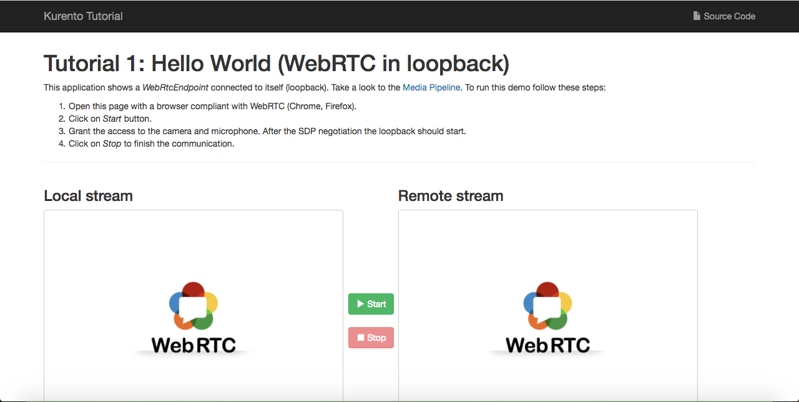

# Kurento
Kurento es un servidor multimedia WebRTC y un grupo de APIs del lado del cliente que facilita el desarrollo de aplicaciones de video avanzadas en aplicaciones Web y en otros dispositivos.   

## Servidores multimedia WebRTC
 
WebRTC es proyecto open source que permite a los navegadores tener una comunicación en tiempo real de manera P2P (Peer to Peer). Por ser así es dificl hacer, por ejemplo, comunicaciones en grupo, por lo cual ciertas aplicaciones requieren de un servidor multimedia.  
El servidor mulitmedia funciona como un middleware entre los dos navegadores, recibiendo el tráfico multimedia y procesandolo antes de enviarlo al otro extremo. 


El procesamiento puede incluir, por ejemplo, enviar a un grupo de receptores (en vez de solo a uno), transcodificar (adaptar formatos para clientes que no son compatibles), grabar, mezclar, etcétera. 


## Arquitectura de Kurento 
Kurento está construido sobre dos capas o planos: 

- Signaling Plane (Plano de señalización): Encargado de manejar las comunicaciones con los clientes (lado derecho de la imagen). Este plano se encuentra del lado de la aplicación. 
- Media Plane (Plano de multimeida): Encargado de llevar a cabo las funcionalidades de de Kurento (lado izquierdo de la imagen). Este plano se encuentra en el Kurento Media Server.


### Kurento Media Server (KMS)
Este es el núcelo de Kurento y la base de todo su funcionamineto. Esta basado en diferentes módulos que realizan procesamientos y que se pueden agregar o quitar a tu aplicación de manera dinámica. 
De igual manera, como programador puedes crear tus propios modulos y utilizarlos con kurento. 
KMS cuenta con módulos para, por ejemplo, comunicación en grupo, mezclas, transcodificación, grabaciones, reproducciones, procesamiento para visión por computadora, realidad aumentada, entre otros. 


### Kurento API

Kurento se muestra hacia el exterior por medio de una API. Para podernos comunicar con la API existen tres formas:

- Usar directamente el protocolo de comunicación de Kurento.
- A través de un cliente de Java. 
- Utilizando el cliente de JavaScript en NodeJS. 


El protocolo de comunicación de Kurento (*Kurento Protocol*) es un protocolo de red que esta basado en "WebSocket" (esta especificación define un socket full duplex de comunicación entre cliente y servidor) y en "JSON-RPC". 

Kurento está compuesto por dos grandes bloques que se utilizan para el desarrollo de aplicaciones: 

- **Media Elements**: Cada uno de ellos son una unidad funcional que llevan a cabo una acción específica sobre multimedia. Se pueden ver como cajas negras a las cuales les entregas multimedia y realizan sobre ellas una acción. Según su funcionamiento se pueden dividir como: 
	- *Input Endpoints*: Son aquellos que son capaces de recibir multimedia y enviarlas a través de un canal de comunicación hacia otro componente. Pueden obtener los datos multimedia a través de un archivo (File Input), a través de una red (Network Input) o directamente de hardware (Capture Input).
	- *Filters*: Son aquellos capaces de transformar y analizar datos multimedia. Pueden, por ejemplo, mezclar, aumentar, analizar, etcétera. 
	- *Hubs*: Son aquellos capaces de manejar muchos flujos de datos multimedia a través de un solo canal de comunicación.
	- *Output Endpoints*: Son aquelos capaces de extraer datos multimedia del canal de comunicación. 

-**Media Pipeline**: Es una cadena de elementos multimedia en donde el flujo de datos generado por una fuente se alimenta a uno o muchos otros elementos. Esta formada por "Media Elements" conectados entre sí.  

Así, tenemos aquí algunos "Media Elements":


Si juntamos dos o más tendremos un "Media Pipeline":


Para información específica sobre diferentes "Media Elements" se puede visitar [aquí](http://doc-kurento.readthedocs.io/en/latest/mastering/kurento_API.html).


## Usando Kurento 
Para poder correr Kurento nececitamos tener instalado en la computadora:
	
* VirtualBox
* SSH
* Vagrant 
* Git

```
# Utilizando la terminal. 
	#### Set up
	# 1. crear carpeta
	mkdir cursoFiware
	# 2. cambiar de directorio
	cd cursoFiware
	# 3. bajar estructura de las máquinas virtuales
	git clone https://github.com/capcaz99/FIWARE.git
	# 4. Cambiar a directorio Fiware
	cd FIWARE
	cd tutorialKurento
	cd vm-kurento
	# 5. iniciar máquina virtual de Kurento, este proceso puede tardar
	vagrant up
	# 6. conectar a máquina virutal por medio de SSH
	vagrant ssh
	# 7. Configuración de JAVA_HOME
	export JAVA_HOME=/usr/lib/jvm/java-7-openjdk-amd64
	export PATH=$JAVA_HOME/bin:$PATH
	# 8. Levantar KMS
	sudo service kurento-media-server-6.0 start
	# Debe de mostrarnos un mensaje: [OK]
	# 9. Para poder verificar que esta corriendo el servidor
	ps -ef | grep kurento-media-server 
	# Debe de haber aparecido kurento-media-server corriendo.
	# 10. Para probar en que puerto está corriendo
	sudo netstat -putan | grep kurento
	# Debe de ser el puerto 8888.
	# 11. Para detener el KMS
	sudo service kurento-media-server-6.0 stop
```
Los pasos anteriores debemos hacerlos para iniciar y detener nuestro servidor, para poder utilizar los siguientes tutoriales debemos hacer los pasos anteriores hasta el paso 8 para tener el KSM corriendo. 
 
### Hello World
 Comenzaremos con un ejemplo sencillo. 
 Después de tener KMS corriendo.
 ```
 	# Desde la temrinal
	# Descargar repositorio de Hello World
	git clone https://github.com/Kurento/kurento-tutorial-java.git
	# Cambiar de carpeta
	cd kurento-tutorial-java/kurento-hello-world
	git checkout 6.6.2
	# Compilar el proyecto
	# No olvides haber inciciado el servidor (KMS).
	mvn compile exec:java
```

Después de haber corrido los comandos anteriores y que en la terminal se pueda leer que la aplicación se ha iniciado (Started:...) ingresar a la página ` https://192.168.81.5:8443/` en chrome o en firefox. 
Puede ser que tu navegador bloquee el acceso a este sitio web, permite que tenga acceso y tendras una pantalla como esta: 



Hay que dar click en "Start" y con eso se iniciará la transmisión de video. 
Del lado izquierdo de nuestra pantalla tenemos el video como se está tomando directamente de nuestra camara web. Del lado derecho tenemos el video como lo está recibiendo el cliente desde el KMS. 
Para lograr esto simplemente se envía el video al KMS y éste lo envía de regreso al cliente sin modificaciones a través de un flujo de datos multimedia.


La aplicación cuenta con tres partes. En primer lugar se encuentra el cliente de JavaScript, que es el que tenemos en nuestro navegador, este cliente se comunica con el servidor de aplicaciones de Java el cual se encarga de conectarse con KMS quien, después de procesar los datos, los regresa para hacerlos llegar al cliente. 

Después de haber utilizado el primer ejemplo tenemos que detener el proceso, para esto: 

```
# Desde la terminal de nuestra máquina virtual
# Teclear ctrl z para detener el proceso
sudo fuser -k 8443/tcp
# Detener el servidor (KMS)
# Regresar a la carpeta inicial
cd ../..
sudo service kurento-media-server-6.0 stop
```

### WebRTC magic mirror
Haremos ahora un segundo ejemplo que contiene más funcionalidades de Kurento. 

```
# Desde la terminal 
# Cambiar de carpeta
cd kurento-tutorial-java/kurento-magic-mirror
git checkout 6.6.0
# Compilar el proyecto
# No olvides haber inciciado el servidor (KMS).
mvn compile exec:java
```

Después de haber corrido los comandos anteriores y que en la terminal se pueda leer que la aplicación se ha iniciado (Started:...) ingresar a la página ` https://192.168.81.5:8443/` en chrome o en firefox. 
Puede ser que tu navegador bloquee el acceso a este sitio web, permite que tenga acceso y tendras una pantalla como la anterior. 

Una vez más, hay que dar click en "Start" y con eso se iniciará la transmisión de video. 
Del lado izquierdo de nuestra pantalla tenemos el video como se está tomando directamente de nuestra camara web. Del lado derecho tenemos el video como lo está recibiendo el cliente desde el KMS. 
Para lograr esto Kurento está utilizando realidad aumentada y visión por computadora para poder poner el sombrero sobre tu cabeza.
Utiliza un "Media Element" del tipo "Filter" para hacer el cambio en los datos multimedia y enviarlos al cliente.  


Despuñes de haber utilizado el primer ejemplo tenemos que detener el proceso, para esto: 

```
# Desde la terminal de nuestra máquina virtual
# Teclear ctrl z para detener el proceso
sudo fuser -k 8443/tcp
# Detener el servidor (KMS)
# Regresar a la carpeta inicial
cd ../..
sudo service kurento-media-server-6.0 stop
```

Después de haber terminado los ejemplos anteriores debemos apagar la máquina virtual. 

```
# Desde la terminal
# Salir de la mv.
exit
# Para apagar la mv.
vagrant halt
```


